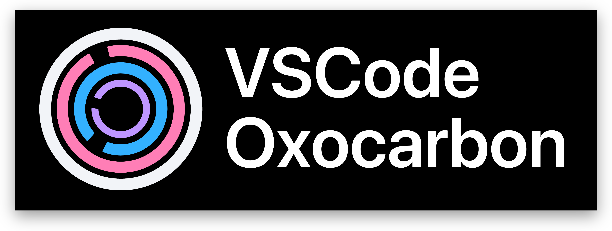

#  


Oxocarbon is a High contrast accessible colorscheme inspired by IBM Carbon. It delivers class-leading readability without strain by adhering to WCAG 2.1 guidelines

Work in Progress

## Features

- Comprehensive semantic highlighting
- Carefully crafted color palette for maximum contrast and readability
- Support for various editor features:
  - Semantic tokens
  - Git decorations
  - Debug & Testing
  - Terminal colors
  - Status bar indicators
  - Editor widgets and overlays
  - Bracket pair colorization
  - Inlay hints
  - Peek view
  - Diff editor
  - Jupyter Notebook support
  - Quick input
  - Menu styling
  - Gauge indicators
  - Minimap customization
  - Banner styling

### Language Support

Any language with a textmate parser and/or language server is supported (i.e. almost all of them)

Oxocarbon also provides handrolled syntax highlighting for:

- C/C++
- Rust
- OCaml
- Lisp
- TOML

## Installation

### Automatic

- TODO https://code.visualstudio.com/api/working-with-extensions/publishing-extension

### Manual

- Download repository source as ZIP
- Unpack in `~/.vscode/extensions` (VSCode) or `~/.cursor/extensions` (Cursor)

### Recommended VSCode Settings

Personal Opinionated `settings.json` and `keybindings.json` located under `assets/` in the GitHub Repository. Recommended to install the `icons-carbon` extension and `Liga SFMono Nerd Font` font beforehand. 

### Development

The following requires `Cargo`/`Rust`. Changes should be made in `oxocarbon.toml`

To generate the JSON file, run `make` in the root directory. To test the colorscheme, press `F5`

Reference https://code.visualstudio.com/api/references/theme-color#editor-widget-colors and https://code.visualstudio.com/api/language-extensions/semantic-highlight-guide for highlight groups

Additionally, add the following in your `keybindings.json` to use `cmd+shift+i` to inspect the highlight at cursor

```
    {
        "key": "cmd+shift+i",
        "command": "editor.action.inspectTMScopes"
    }
```

## Contributing

Before contributing, its recommended to read through the [style guide](https://github.com/nyoom-engineering/oxocarbon/blob/main/docs/style-guide.md). Discussion primarily takes place on the Nyoom Engineering discord server: https://discord.gg/M528tDKXRG

## License

The project is vendored under the MIT license
